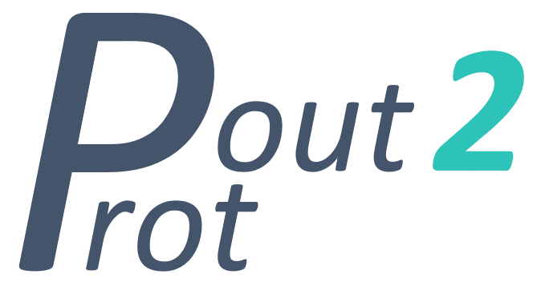

# pout2prot



pout2prot converts Percolator output files to protein group and subgroup files (Occam or anti-Occam) as input for Prophane. 

Meeting notes: https://docs.google.com/document/d/12etWvbd9oKIEFXSZ44v1uHhZxaaMiZPX9JuAAHh7c7c/edit
Manuscript: https://docs.google.com/document/d/1FNHL_Zm_ikYrPMg4ul0PANL3YFpXq346L68K7XJeMYk/edit

## Getting Started

These instructions will get you a copy of the project up and running on your local machine.

### Prerequisites

Scripts are written in python 3. One easy way to get started is installing 
[miniconda 3](https://docs.conda.io/en/latest/miniconda.html).

On Linux..
On MacOS
On Windows..

### Installing

Clone the repository: 

```shell script
https://github.com/tivdnbos/pout2prot.git
```

## Which protein grouping strategy to use?

In pout2prot, the user can choose between two protein grouping strategies: Occam’s razor and anti-Occam’s razor. Occam’s razor is based on the principle of maximum parsimony, and provides the smallest set of proteins that explains all observed peptides. Here, proteins and their associated taxonomy and functions are expected to be present in the sample, but proteins that by chance could not be matched to a unique peptide are falsely discarded. This algorithm is for example used in the X!TandemPipeline. On the other hand, anti-Occam’s razor is based on the maximal explanatory set of proteins. Here, any protein that contains at least one identified peptide, will be provided in the protein list. This algorithm is used in for example the MetaProteomeAnalyzer (MPA). Importantly, while it is important to mention which grouping algorithm was used, there is no way to determine which algorithm is more correct.

## License

This project is licensed under the Apache License 2.0 - see the [LICENSE](LICENSE) file for details

